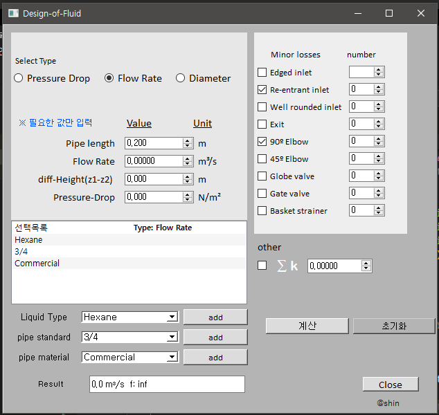

# Design of fluid thermal systems

## Selected topics in Fluid Mechanics

This program solves the problems in Chapter 4 of the "Design of Fluid Thermal Systems" textbook on pressure differential, flow rate, and diameter.

